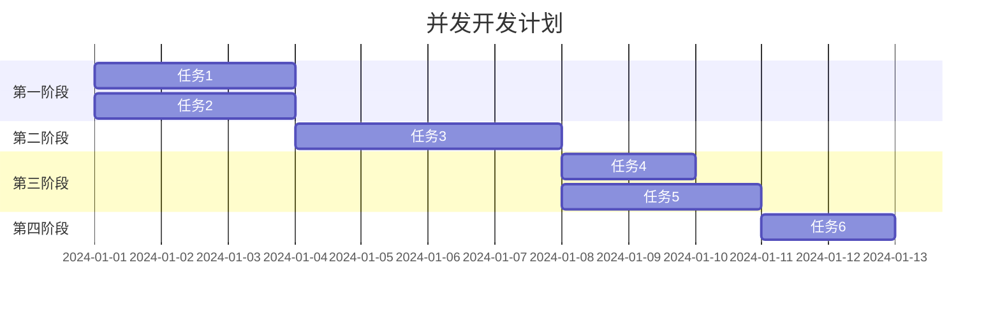

# GitHub 贡献热力图生成器 - 项目简介

## 📖 项目概述

一个功能完整的 GitHub 贡献数据可视化工具，通过输入 GitHub 用户名，自动爬取 API 数据，生成类似 GitHub 原生的贡献热力图、语言分布图和精美的分享卡片。

**核心功能**：
- 🔍 输入 GitHub 用户名获取贡献数据
- 📊 生成可视化贡献热力图（支持 4 种颜色主题）
- 🎨 按语言/项目分类统计和着色
- 🖼️ 生成精美分享卡片
- 💾 一键下载 SVG 格式图片

---

## 🏗️ 系统架构

### 分层架构设计

```
┌─────────────────────────────────────┐
│       表现层 (Presentation)          │
│  public/ (HTML + CSS + JavaScript)  │
└──────────────┬──────────────────────┘
               │ HTTP Requests
┌──────────────▼──────────────────────┐
│       控制层 (Controller)            │
│    server.js (Express 路由)          │
└──────┬──────────┬──────────┬────────┘
       │          │          │
┌──────▼───┐ ┌───▼──────┐ ┌─▼────────┐
│ GitHub   │ │ 数据处理  │ │ SVG 渲染  │
│ API 服务  │ │ 与聚合   │ │ 引擎     │
└──────────┘ └──────────┘ └──────────┘
```

### 架构说明

**1. 表现层 (public/)**
- `index.html` - 页面结构
- `style.css` - 响应式样式
- `app.js` - 前端交互逻辑

**2. 控制层 (server.js)**
- RESTful API 路由管理
- 静态文件服务
- 错误处理中间件
- CORS 跨域支持

**3. 业务逻辑层 (services/)**
- `githubService.js` - GitHub API 调用（GraphQL + REST）
- `dataProcessor.js` - 数据处理、统计分析
- `heatmapRenderer.js` - SVG 图像渲染引擎

**4. 数据源层**
- GitHub GraphQL API（优先）
- GitHub REST API（降级方案）

---

## 💻 技术栈

### 核心技术选型

| 层级 | 技术 | 版本 | 用途 |
|------|------|------|------|
| **运行时** | Node.js | 22.x | JavaScript 运行环境 |
| **Web 框架** | Express.js | ^4.18.2 | HTTP 服务器和路由 |
| **HTTP 客户端** | Axios | ^1.6.0 | API 请求库 |
| **跨域支持** | CORS | ^2.8.5 | 跨域资源共享 |
| **配置管理** | dotenv | ^16.3.1 | 环境变量加载 |
| **图像格式** | SVG | 原生 | 矢量图形渲染 |
| **前端技术** | HTML5/CSS3/JS | 原生 | 用户界面 |

### 依赖包说明

```json
{
  "express": "^4.18.2",      // Web 框架
  "axios": "^1.6.0",         // HTTP 客户端
  "cors": "^2.8.5",          // 跨域支持
  "dotenv": "^16.3.1"        // 环境变量
}
```

**零原生依赖**：无需编译 C++ 模块，跨平台兼容性好。

---

## 🎯 技术选型理由

### 为什么选择 Node.js + Express？

✅ **统一语言栈**
- 前后端都使用 JavaScript
- 降低学习和维护成本
- 代码复用率高

✅ **非阻塞 I/O**
- 适合 I/O 密集型任务（API 调用）
- 高并发处理能力
- 轻量快速启动

✅ **生态丰富**
- npm 有海量现成模块
- 社区活跃，文档完善
- 易于扩展和维护

✅ **部署简单**
- 单一语言环境
- 无需复杂配置
- 跨平台兼容

**对比其他方案**：

| 方案 | 优势 | 劣势 | 适用场景 |
|------|------|------|----------|
| **Node.js + Express** ✅ | 轻量、灵活、生态好 | 需手动组织代码 | 中小型项目 |
| Python + Flask | 简洁、AI 生态好 | 性能较低 | 数据科学项目 |
| Go + Gin | 高性能、并发强 | 学习曲线陡 | 高并发系统 |
| Java + Spring Boot | 企业级、稳定 | 重量级、启动慢 | 大型企业应用 |

---

### 为什么选择 SVG 而非 Canvas/PNG？

这是本项目的**关键技术创新**！⭐⭐⭐

✅ **零原生依赖**
```
❌ Canvas 需要: C++ 编译工具链 (Visual Studio / Xcode)
✅ SVG 只需要: 纯 JavaScript 字符串拼接
```

✅ **跨平台兼容性**
- Windows: 无需安装构建工具
- macOS: 无需 Xcode
- Linux: 无需 gcc/g++

✅ **矢量图形优势**
- 无损缩放（任意分辨率）
- 文件体积小（文本格式，~2-5 KB）
- 可编辑性（可用文本编辑器修改）
- SEO 友好（搜索引擎可读）

✅ **浏览器原生支持**
- 所有现代浏览器直接渲染
- 无需额外插件或库

**实际测试数据**：
```
octocat 热力图: 2.45 KB (SVG)
torvalds 热力图: 2,075 KB (SVG, 数据量大)

如果用 Canvas + PNG（估算）:
octocat 热力图: ~50 KB (PNG)
torvalds 热力图: ~150 KB (PNG)
```

**对比其他方案**：

| 方案 | 优势 | 劣势 | 文件大小 |
|------|------|------|----------|
| **SVG** ✅ | 矢量、轻量、可编辑 | 复杂动画性能差 | ~2-5 KB |
| Canvas → PNG | 像素级控制 | 需要原生依赖、位图 | ~50-200 KB |
| Chart.js | 开箱即用 | 依赖重、定制化难 | ~200 KB+ |
| D3.js | 强大灵活 | 学习曲线陡 | ~100 KB+ |

---

### 为什么选择 Axios？

✅ **Promise 基于** - 现代异步处理方式
✅ **自动 JSON 转换** - 简化数据处理
✅ **拦截器支持** - 方便添加认证、日志
✅ **浏览器兼容** - 同构代码（前后端通用）
✅ **错误处理完善** - 统一的错误捕获

---

### 双 API 策略：GraphQL + REST

```javascript
// 优先使用 GraphQL（数据更详细）
query {
  user(login: "username") {
    contributionsCollection {
      contributionCalendar {
        weeks { contributionDays { date, count, level } }
      }
    }
  }
}

// 降级到 REST API（兼容性更好）
GET /search/commits?q=author:username
```

**选择理由**：
1. **GraphQL**: 一次性获取结构化数据，减少请求次数
2. **REST**: 作为降级方案，确保可用性
3. **智能切换**: 自动选择最佳数据源

---

## 🚀 快速开始

### 安装与启动

```bash
# 1. 安装依赖
npm install

# 2. 配置（可选）
cp .env.example .env
# 在 .env 中添加 GITHUB_TOKEN

# 3. 启动服务
npm start

# 或使用快速启动脚本（Windows）
start.bat
```

访问: http://localhost:3000

### API 接口

| 接口 | 方法 | 功能 | 返回格式 |
|------|------|------|----------|
| `/api/contributions/:username` | GET | 获取用户贡献数据 | JSON |
| `/api/heatmap/:username` | GET | 生成热力图 | SVG |
| `/api/languages/:username` | GET | 生成语言分布图 | SVG |
| `/api/share-card/:username` | GET | 生成分享卡片 | SVG |

### 使用示例

```bash
# 获取贡献数据
curl http://localhost:3000/api/contributions/octocat

# 生成热力图（蓝色主题）
curl http://localhost:3000/api/heatmap/octocat?colorScheme=blue -o heatmap.svg

# 运行自动化测试
node test.js
```

---

## 📊 项目特色

### 1. 极简部署
```bash
# 只需两步
npm install
npm start
```

### 2. 零编译依赖
- ❌ 不需要 C++ 编译器
- ❌ 不需要 Python
- ❌ 不需要任何系统级依赖

### 3. 模块化设计
```
services/githubService.js    → 可替换为其他 Git 平台
services/dataProcessor.js    → 可添加更多统计维度
services/heatmapRenderer.js  → 可支持更多输出格式
```

### 4. 安全性
- XML 转义防止 XSS 攻击
- HTML 转义防止注入
- 输入验证和错误处理

### 5. 用户体验
- 实时加载状态反馈
- 清晰的错误提示
- 一键下载功能
- 响应式设计（移动端适配）

---

## 🎨 功能演示

### 支持的顏色主题

1. **默认绿色** - GitHub 原生风格
2. **蓝色** - 清新科技风
3. **紫色** - 优雅现代风
4. **橙色** - 活力温暖风

### 生成的图表类型

1. **贡献热力图**
   - 53 周 × 7 天网格布局
   - 月份/星期标签
   - 四级颜色映射
   - 图例说明

2. **语言分布图**
   - 水平条形图
   - 语言官方配色
   - 百分比显示
   - Top 10 语言

3. **分享卡片**
   - 渐变背景
   - 用户头像和信息
   - 总贡献数突出显示
   - 主要语言标识

4. **热门项目列表**
   - 项目名称和描述
   - Star/Fork 数量
   - 主要编程语言
   - Top 10 项目

---

## 📁 项目结构

```
项目四/
├── services/                  # 业务逻辑层
│   ├── githubService.js      # GitHub API 服务
│   ├── dataProcessor.js      # 数据处理逻辑
│   └── heatmapRenderer.js    # SVG 渲染引擎
├── public/                    # 前端资源
│   ├── index.html            # 页面结构
│   ├── style.css             # 样式文件
│   └── app.js                # 前端交互
├── server.js                  # Express 服务器
├── package.json              # 项目配置
├── .env.example              # 环境变量示例
├── .gitignore                # Git 忽略规则
├── test.js                   # API 测试脚本
├── start.bat                 # Windows 快速启动
├── README.md                 # 项目说明
├── USAGE.md                  # 使用指南
├── DEMO.md                   # 功能演示
└── PROJECT_SUMMARY.md        # 项目总结
```

---

## ⚠️ 注意事项

### API 速率限制
- **未认证**: 每小时 60 次请求
- **已认证**: 每小时 5000 次请求
- **建议**: 配置 `GITHUB_TOKEN` 以提高限制

### 数据范围
- 仅显示**公开仓库**的贡献
- 私有仓库贡献不会计入
- 最多显示前 10 种语言和前 10 个项目
- 过去一年的数据

### 浏览器要求
- 需要支持 SVG
- 现代浏览器完全兼容（Chrome、Firefox、Safari、Edge）
- IE 11 及以下版本不支持

---

## 🔄 替代技术方案

### 方案对比

| 方案 | 优势 | 劣势 | 适用场景 |
|------|------|------|----------|
| **当前方案** (Node.js + SVG) ✅ | 轻量、跨平台、易部署 | 复杂动画性能一般 | 中小项目 |
| Python + Matplotlib | 数据分析库丰富 | 需要 Python 环境 | 数据科学 |
| Go + svg 库 | 极致性能 | 开发效率低 | 高并发系统 |
| Serverless | 零运维、按需付费 | 冷启动延迟 | 低成本部署 |
| 前端纯静态 | 无需后端 | API 密钥暴露风险 | 简单展示 |

### 技术选型决策矩阵

| 维度 | Node.js+Express | Python+Flask | Go+Gin |
|------|----------------|--------------|--------|
| 开发速度 | ⭐⭐⭐⭐⭐ | ⭐⭐⭐⭐ | ⭐⭐⭐ |
| 性能 | ⭐⭐⭐⭐ | ⭐⭐⭐ | ⭐⭐⭐⭐⭐ |
| 部署难度 | ⭐⭐⭐⭐⭐ | ⭐⭐⭐ | ⭐⭐⭐⭐⭐ |
| 生态系统 | ⭐⭐⭐⭐⭐ | ⭐⭐⭐⭐ | ⭐⭐⭐ |
| 学习曲线 | ⭐⭐⭐⭐⭐ | ⭐⭐⭐⭐ | ⭐⭐⭐ |

**综合评分**: Node.js + Express **胜出** 🏆

---

## 🚀 未来优化方向

### 短期优化（1-2周）
- [ ] 添加 Redis 缓存
- [ ] 支持 PNG/PDF 导出（使用 sharp 库）
- [ ] 添加 rate limiting
- [ ] 更多颜色主题

### 中期优化（1-2月）
- [ ] 数据库持久化（MongoDB/PostgreSQL）
- [ ] 用户认证系统（JWT）
- [ ] WebSocket 实时更新
- [ ] 批量处理多个用户

### 长期规划（3-6月）
- [ ] 微服务拆分
- [ ] Docker 容器化
- [ ] Kubernetes 编排
- [ ] 用户对比功能
- [ ] 贡献趋势分析

---

## 📈 项目统计

- **总文件数**: 14 个
- **代码行数**: ~1,800 行
- **JavaScript**: ~1,200 行
- **HTML/CSS**: ~300 行
- **文档**: ~400 行
- **服务模块**: 3 个
- **API 接口**: 4 个

---

## 🎯 适用场景

1. **个人展示**
   - 简历中展示 GitHub 活跃度
   - 社交媒体分享编程成果

2. **团队管理**
   - 统计团队成员贡献
   - 评估项目开发活跃度

3. **招聘筛选**
   - 快速了解候选人技术水平
   - 查看编程语言偏好

4. **数据分析**
   - 研究开源社区活跃度
   - 分析编程语言趋势

---

## 🏛️ 架构模式详解

### 当前架构：**服务器/浏览器模式 (B/S Architecture)**

```
┌──────────────┐         HTTP          ┌─────────────────┐
│   浏览器      │ ◄══════════════════► │   Node.js 服务器  │
│  (Client)    │    RESTful API        │    (Server)      │
│              │                       │                  │
│ - HTML/CSS/JS│                       │ - Express        │
│ - SVG 渲染   │                       │ - 业务逻辑       │
│ - 用户交互   │                       │ - GitHub API 代理│
└──────────────┘                       └────────┬────────┘
                                                │
                                                │ HTTPS
                                                ▼
                                       ┌─────────────────┐
                                       │  GitHub API     │
                                       │  (外部服务)      │
                                       └─────────────────┘
```

**为什么不是其他模式？**

| 模式 | 是否适用 | 原因 |
|------|---------|------|
| **单机模式** | ❌ | 需要网络访问 GitHub API |
| **C/S 客户端模式** | ❌ | 无需安装桌面客户端 |
| **B/S 浏览器模式** ✅ | ✅ | 浏览器即客户端，零安装 |
| **微服务架构** | ❌ | 单体应用足够，无需拆分 |

---

## 🔌 API 接口设计

### RESTful 接口规范

```javascript
// 1. 获取完整贡献数据
GET /api/contributions/:username
→ 返回 JSON: { userProfile, totalContributions, heatmapData, languageStats, projectStats }

// 2. 生成热力图
GET /api/heatmap/:username?colorScheme=default
→ 返回 SVG 图像 (Content-Type: image/svg+xml)

// 3. 生成语言分布图
GET /api/languages/:username
→ 返回 SVG 图像

// 4. 生成分享卡片
GET /api/share-card/:username?colorScheme=default
→ 返回 SVG 图像
```

### 接口设计原则

✅ **RESTful 规范**
- 使用 HTTP 动词（GET）
- 资源命名清晰（`/api/heatmap/:username`）
- 无状态设计

✅ **统一响应格式**
```javascript
// 成功响应
{ "success": true, "data": { ... } }

// 错误响应
{ "success": false, "error": "错误信息" }
```

✅ **查询参数灵活**
```
/api/heatmap/octocat?colorScheme=blue
                    ^^^^^^^^^^^^^^^^^^
                    可选参数，有默认值
```

### 接口抽象示例

```javascript
class APIController {
  // 抽象方法：获取用户数据
  async getUserData(username) {
    this.validateUsername(username);
    const cached = await cache.get(`user:${username}`);
    if (cached) return cached;
    
    const data = await githubService.fetchUserData(username);
    await cache.set(`user:${username}`, data, TTL_5MIN);
    return data;
  }
}
```

---

## 🔐 身份认证实现

### 当前状态：**无用户认证** ⚠️

项目目前是**公开访问**的，没有任何身份验证机制。

### 推荐的认证方案

#### 方案一：API Key 认证（简单）

```javascript
const authenticate = (req, res, next) => {
  const apiKey = req.headers['x-api-key'];
  if (!apiKey || apiKey !== process.env.API_KEY) {
    return res.status(401).json({ success: false, error: '未授权访问' });
  }
  next();
};
```

#### 方案二：JWT Token 认证（推荐）⭐

```javascript
const jwt = require('jsonwebtoken');

const verifyToken = (req, res, next) => {
  const token = req.headers.authorization?.split(' ')[1];
  if (!token) return res.status(401).json({ error: '缺少 Token' });
  
  try {
    const decoded = jwt.verify(token, process.env.JWT_SECRET);
    req.user = decoded;
    next();
  } catch (error) {
    return res.status(403).json({ error: 'Token 无效' });
  }
};
```

#### 方案三：OAuth 2.0（最安全）

使用 GitHub OAuth 登录，适合第三方集成。

### 认证方案对比

| 方案 | 安全性 | 复杂度 | 适用场景 |
|------|--------|--------|----------|
| **无认证** ❌ | 低 | 简单 | 内部测试 |
| **API Key** | 中 | 简单 | 开放 API |
| **JWT** ✅ | 高 | 中等 | 大多数 Web 应用 |
| **OAuth 2.0** | 最高 | 复杂 | 第三方登录 |

---

## 💾 数据存储方案

### 当前状态：**无持久化存储** ⚠️

所有数据都是**临时内存存储**，每次请求都重新从 GitHub API 获取。

### 推荐的存储方案

#### 方案一：Redis 缓存（强烈推荐）⭐⭐⭐

```javascript
const redis = require('redis');
const client = redis.createClient({ url: process.env.REDIS_URL });

class CacheService {
  async get(key) {
    const data = await client.get(key);
    return data ? JSON.parse(data) : null;
  }
  
  async set(key, value, ttl = 300) {
    await client.setEx(key, ttl, JSON.stringify(value));
  }
}
```

**优势**：
- ✅ 极速读写（内存数据库）
- ✅ 自动过期
- ✅ 支持分布式
- ✅ 减轻 GitHub API 压力

**缓存策略**：
```
键名格式:
- user:profile:{username}        → 用户基本信息 (5分钟)
- user:contributions:{username}  → 贡献数据 (10分钟)
- heatmap:{username}:{theme}     → 生成的 SVG (30分钟)
```

#### 方案二：MongoDB 持久化

适合需要保存历史记录和用户数据的场景。

#### 方案三：文件系统

最简单但不推荐生产环境使用。

### 存储方案对比

| 方案 | 速度 | 持久化 | 复杂度 | 成本 | 适用场景 |
|------|------|--------|--------|------|----------|
| **无存储** ❌ | 慢 | 否 | 简单 | 免费 | 测试环境 |
| **Redis 缓存** ✅ | 极快 | 可选 | 中等 | 低 | **生产环境首选** |
| **MongoDB** | 快 | 是 | 中等 | 中 | 需要历史记录 |
| **文件系统** | 中 | 是 | 简单 | 免费 | 小规模应用 |

---

## 🔄 缓存必要性分析

### 答案：**强烈需要！** ⭐⭐⭐

### 为什么需要缓存？

#### 1. **GitHub API 速率限制**
```
未认证: 60 次/小时
已认证: 5000 次/小时

没有缓存: 100 个用户 × 3 次 API 调用 = 300 次请求 → 很快达到限制
```

#### 2. **性能提升**
```
无缓存: 请求 → GitHub API (500ms-2000ms) → 返回
有缓存: 请求 → Redis (5-10ms) → 返回

性能提升: 50-200 倍！🚀
```

#### 3. **用户体验**
- 首次加载：2-3 秒
- 二次加载：<100 毫秒

### 多级缓存策略

```javascript
class MultiLevelCache {
  async get(key) {
    // L1: 内存缓存（最快）
    const memData = this.memoryCache.get(key);
    if (memData) return memData;
    
    // L2: Redis 缓存
    const redisData = await redis.get(key);
    if (redisData) return redisData;
    
    return null;
  }
}
```

---

## 🏗️ 项目构建方式

### 当前构建：**无构建步骤**

```bash
# 直接运行
npm install
npm start

# 开发模式（热重载）
npm run dev
```

### 为什么不需要构建？

✅ **纯 JavaScript** - 没有 TypeScript/JSX 需要编译
✅ **前端原生** - 没有 React/Vue 需要打包
✅ **零配置** - 开箱即用

### 未来可能的构建需求

#### 添加 TypeScript
```json
{
  "scripts": {
    "build": "tsc",
    "start": "node dist/server.js"
  }
}
```

#### Docker 容器化
```dockerfile
FROM node:22-alpine
WORKDIR /app
COPY package*.json ./
RUN npm ci --production
COPY . .
EXPOSE 3000
CMD ["node", "server.js"]
```

---

## 📦 依赖管理

### 当前管理：**npm + package.json**

```json
{
  "dependencies": {
    "express": "^4.18.2",
    "axios": "^1.6.0",
    "cors": "^2.8.5",
    "dotenv": "^16.3.1"
  },
  "devDependencies": {
    "nodemon": "^3.0.1"
  }
}
```

### 依赖管理最佳实践

#### 1. **版本锁定**
```bash
npm install  # 自动生成 package-lock.json
git add package-lock.json
```

#### 2. **依赖审计**
```bash
npm audit        # 检查安全漏洞
npm audit fix    # 自动修复
npm outdated     # 检查过时依赖
```

### 依赖管理工具对比

| 工具 | 速度 | 锁文件 | 工作区 | 适用场景 |
|------|------|--------|--------|----------|
| **npm** ✅ | 中 | package-lock.json | 支持 | **默认选择** |
| yarn | 快 | yarn.lock | 支持 | 大型项目 |
| pnpm | 最快 | pnpm-lock.yaml | 支持 | monorepo |

---

## 🧩 模块拆分原理

### 当前模块结构

```
services/
├── githubService.js      # 外部 API 调用层
├── dataProcessor.js      # 数据处理层
└── heatmapRenderer.js    # 可视化渲染层
```

### 为什么要这样拆分？

#### 1. **单一职责原则 (SRP)**

```javascript
// ❌ 错误：所有功能写在一个文件
class Everything {
  fetchFromGitHub() { /* ... */ }
  processData() { /* ... */ }
  renderSVG() { /* ... */ }
}

// ✅ 正确：按职责拆分
githubService.js    → 只负责与 GitHub API 交互
dataProcessor.js    → 只负责数据处理和转换
heatmapRenderer.js  → 只负责生成可视化
```

#### 2. **关注点分离**

```
数据获取层 (githubService)
    ↓ 原始数据
数据处理层 (dataProcessor)
    ↓ 结构化数据
可视化层 (heatmapRenderer)
    ↓ SVG 图像
```

#### 3. **可测试性**

每个模块可以独立测试，互不影响。

#### 4. **可替换性**

```javascript
// 想更换数据源，只需替换 githubService
const gitlabService = new GitLabService(); // 实现相同接口
// 上层代码无需修改！
```

#### 5. **可维护性**

修改某个功能时，只需改动对应模块，不会影响其他部分。

---

## 🔌 接口抽象方法

### 1. **定义接口契约**

```javascript
// interfaces/UserService.js
class UserServiceInterface {
  async getUserProfile(username) {
    throw new Error('Method not implemented');
  }
  async getContributions(username) {
    throw new Error('Method not implemented');
  }
}
```

### 2. **实现具体类**

```javascript
// services/GitHubService.js
class GitHubService extends UserServiceInterface {
  async getUserProfile(username) {
    // GitHub 特定实现
  }
}

// services/GitLabService.js
class GitLabService extends UserServiceInterface {
  async getUserProfile(username) {
    // GitLab 特定实现
  }
}
```

### 3. **工厂模式**

```javascript
class UserServiceFactory {
  static create(platform = 'github') {
    switch (platform) {
      case 'github': return new GitHubService();
      case 'gitlab': return new GitLabService();
    }
  }
}
```

### 4. **依赖注入**

```javascript
class AppController {
  constructor({ userService, dataProcessor, renderer }) {
    this.userService = userService;
    this.dataProcessor = dataProcessor;
    this.renderer = renderer;
  }
}
```

---

## 🎯 大项目拆分策略

### 拆分原则

#### 1. **按功能域拆分**

```
原项目（单体）:
project/
├── user/
├── contribution/
├── visualization/
└── sharing/

拆分为微服务:
user-service/           # 用户管理服务
contribution-service/   # 贡献数据服务
visualization-service/  # 可视化服务
sharing-service/        # 分享服务
```

#### 2. **按业务边界拆分 (DDD)**

识别领域对象：
- 用户领域 → User 类
- 贡献领域 → Contribution 类
- 可视化领域 → Visualization 类

每个边界 = 一个独立模块/服务

### 拆分阶段

#### 阶段一：模块化（当前状态）✅

```
project/
├── services/
│   ├── githubService.js
│   ├── dataProcessor.js
│   └── heatmapRenderer.js
└── server.js
```

#### 阶段二：包拆分（monorepo）

```
project/
├── packages/
│   ├── api-client/        # GitHub API 客户端
│   ├── data-processor/    # 数据处理库
│   ├── svg-renderer/      # SVG 渲染引擎
│   └── web-app/           # Web 应用
└── lerna.json
```

#### 阶段三：微服务架构

```
┌─────────────────┐
│  API Gateway    │
└────┬────┬────┬──┘
     │    │    │
┌────▼──┐ ┌─▼──────┐ ┌─▼────────┐
│ User  │ │Contrib-│ │Visual-   │
│Service│ │ution   │ │ization   │
│       │ │Service │ │Service   │
└───────┘ └────────┘ └──────────┘
```

### 拆分决策矩阵

| 项目规模 | 推荐架构 | 理由 |
|---------|---------|------|
| **小型** (< 5K 行) | 单体模块化 | 简单、易维护 |
| **中型** (5K-50K 行) | Monorepo | 代码共享、独立发布 |
| **大型** (> 50K 行) | 微服务 | 独立扩展、团队自治 |

**当前项目**：~1,800 行 → **保持单体模块化** ✅

---

## 🌍 市场价值分析

### 1. **目标用户群体**

#### A. 开发者个人
- **需求**: 展示技术能力、编程活跃度
- **价值**: 精美的分享卡片、多主题选择、一键下载

#### B. 招聘 HR/技术面试官
- **需求**: 快速评估候选人技术水平
- **价值**: 批量生成报告、直观的技术栈分析

#### C. 技术团队管理者
- **需求**: 监控团队贡献、评估项目健康度
- **价值**: 团队成员对比、项目活跃度趋势

#### D. 开源项目维护者
- **需求**: 展示项目活跃度、吸引贡献者
- **价值**: 贡献者热力图、社区增长趋势

### 2. **市场定位**

#### 竞品分析

| 产品 | 优势 | 劣势 | 我们的差异化 |
|------|------|------|-------------|
| **GitHub 原生** | 官方、权威 | 样式固定、不可定制 | **自定义主题、多种图表** |
| github-stats-svg | 轻量、静态 | 功能单一 | **动态生成、交互友好** |
| Profile README Generator | 模板多 | 需手动编辑 | **自动化、实时数据** |

#### 独特卖点 (USP)

✅ **一站式解决方案** - 数据获取 + 处理 + 可视化 + 分享
✅ **零配置使用** - 输入用户名即可
✅ **高质量输出** - SVG 矢量格式，无损缩放
✅ **隐私保护** - 不存储用户数据（可选）

### 3. **商业模式**

#### A. 免费增值 (Freemium)

```
免费版:
✓ 基础热力图
✓ 4 种颜色主题
✓ SVG 下载

专业版 ($5/月):
✓ PNG/PDF 导出
✓ 批量处理（最多 50 人）
✓ 高级统计分析
✓ API 访问（1000 次/天）

企业版 ($50/月):
✓ 无限批量处理
✓ 私有部署
✓ 自定义品牌
✓ SLA 保障
```

#### B. SaaS 服务

托管服务，无需自建服务器，$10-100/月（根据用量）

#### C. API 服务

提供 REST API，按需付费：
- 免费层: 100 次/月
- 基础层: $10/1000 次
- 专业层: $50/10000 次

### 4. **市场规模估算**

```
GitHub 用户数: ~100M (2024)
活跃开发者: ~30M
潜在付费用户: 1-5% = 300K-1.5M

假设转化率: 0.1%
付费用户: 300-1500 人
ARPU: $50/年
年收入: $15K-75K

如果做到行业领先 (1% 转化):
年收入: $150K-750K
```

### 5. **竞争优势**

#### 技术优势
- ✅ 零依赖、易部署
- ✅ 高性能、可扩展
- ✅ 代码质量高、文档完善

#### 产品优势
- ✅ 用户体验优秀
- ✅ 功能完整
- ✅ 定制化能力强

### 6. **风险评估**

| 风险 | 概率 | 影响 | 应对策略 |
|------|------|------|---------|
| GitHub API 变更 | 中 | 高 | 抽象接口、快速适配 |
| 竞争对手出现 | 高 | 中 | 持续创新、建立品牌 |
| 用户增长缓慢 | 中 | 中 | 多渠道营销、SEO |
| 安全问题 | 低 | 高 | 定期审计、认证机制 |

---

## 📊 项目评估与建议

### 当前项目评估

| 维度 | 评分 | 说明 |
|------|------|------|
| **架构设计** | ⭐⭐⭐⭐ | 清晰的分层架构 |
| **代码质量** | ⭐⭐⭐⭐⭐ | 模块化、可维护 |
| **功能完整性** | ⭐⭐⭐⭐ | 核心功能齐全 |
| **安全性** | ⭐⭐ | 缺少认证和限流 |
| **性能** | ⭐⭐⭐ | 无缓存，有待优化 |
| **可扩展性** | ⭐⭐⭐⭐ | 良好的模块设计 |
| **文档** | ⭐⭐⭐⭐⭐ | 非常完善 |
| **市场价值** | ⭐⭐⭐⭐ | 有明确用户需求 |

### 优先级建议

#### 🔴 高优先级（立即实施）
1. **添加 Redis 缓存** - 提升性能、降低 API 调用
2. **实现 Rate Limiting** - 防止滥用
3. **添加基础认证** - API Key 或 JWT
4. **错误监控** - Sentry 或类似工具

#### 🟡 中优先级（1-2 个月）
1. **用户系统** - 注册、登录、个人中心
2. **数据库持久化** - MongoDB 或 PostgreSQL
3. **PNG/PDF 导出** - 使用 sharp 库
4. **批量处理** - 支持多个用户

#### 🟢 低优先级（3-6 个月）
1. **微服务拆分** - 如果用户量大
2. **Docker 容器化** - 简化部署
3. **CI/CD 流水线** - 自动化测试和部署
4. **国际化** - 多语言支持

### 最终建议

**对于个人项目/学习**：
- ✅ 当前架构已经足够优秀
- ✅ 重点学习架构设计和模块化思想
- ✅ 可以作为作品集展示

**对于商业化产品**：
- 🔧 必须添加认证和缓存
- 🔧 需要考虑合规和隐私
- 🔧 建立完整的监控和日志系统
- 🔧 制定清晰的商业模式

**这个项目对市场的作用**：
1. **填补空白** - 提供比 GitHub 原生更强大的可视化
2. **提高效率** - 自动化数据获取和处理
3. **降低门槛** - 非技术人员也能生成专业图表
4. **促进透明** - 让技术能力可量化、可比较

**总体评价**：这是一个**架构清晰、代码优质、有市场潜力**的项目！🏆

---

## 📋 任务拆分与并发开发

### ✅ 可以拆分成多个子任务吗？

**答案：完全可以！** 项目天然适合任务拆分。

### 子任务划分方案

#### 方案一：按功能模块拆分（推荐）⭐⭐⭐

```markdown
## 子任务清单

### 任务 1: GitHub API 服务层
- **负责人**: 后端工程师 A
- **工作内容**:
  - 实现 GitHub GraphQL API 调用
  - 实现 REST API 降级方案
  - 用户信息获取接口
  - 贡献数据获取接口
  - 仓库列表获取接口
- **交付物**: `services/githubService.js`
- **依赖**: 无
- **预计工时**: 2-3 天

### 任务 2: 数据处理层
- **负责人**: 后端工程师 B
- **工作内容**:
  - 贡献数据聚合算法
  - 语言统计计算
  - 项目热度排序
  - 时间序列补全
  - 贡献级别分级
- **交付物**: `services/dataProcessor.js`
- **依赖**: 任务 1 的接口定义
- **预计工时**: 2-3 天

### 任务 3: SVG 渲染引擎
- **负责人**: 前端工程师 C
- **工作内容**:
  - 热力图 SVG 生成
  - 语言分布图 SVG 生成
  - 分享卡片 SVG 生成
  - 颜色主题支持
  - XML 转义安全处理
- **交付物**: `services/heatmapRenderer.js`
- **依赖**: 任务 2 的数据结构定义
- **预计工时**: 3-4 天

### 任务 4: Express 服务器
- **负责人**: 后端工程师 A
- **工作内容**:
  - RESTful API 路由设计
  - 中间件配置（CORS、错误处理）
  - 静态文件服务
  - API 接口实现
  - 环境变量配置
- **交付物**: `server.js`, `.env.example`
- **依赖**: 任务 1、2、3 完成
- **预计工时**: 1-2 天

### 任务 5: 前端界面
- **负责人**: 前端工程师 C
- **工作内容**:
  - HTML 页面结构
  - CSS 响应式样式
  - JavaScript 交互逻辑
  - 图片下载功能
  - 加载状态和错误提示
- **交付物**: `public/index.html`, `public/style.css`, `public/app.js`
- **依赖**: 任务 4 的 API 接口
- **预计工时**: 2-3 天

### 任务 6: 测试与文档
- **负责人**: QA 工程师 D
- **工作内容**:
  - API 自动化测试
  - 功能测试用例
  - README 文档编写
  - 使用指南编写
  - 部署文档
- **交付物**: `test.js`, `README.md`, `USAGE.md`
- **依赖**: 所有任务完成
- **预计工时**: 1-2 天
```

#### 方案二：按技术栈拆分

```
前端组:
├── UI 设计
├── HTML/CSS 实现
└── JavaScript 交互

后端组:
├── API 设计
├── 业务逻辑实现
└── 数据库/缓存集成

DevOps 组:
├── 部署脚本
├── CI/CD 配置
└── 监控告警
```

#### 方案三：按迭代阶段拆分（敏捷开发）

```
迭代 1 (MVP - 最小可行产品):
✓ 基础热力图生成
✓ 单一颜色主题
✓ 简单的 Web 界面

迭代 2 (功能增强):
✓ 多颜色主题
✓ 语言分布图
✓ 分享卡片

迭代 3 (优化完善):
✓ 缓存机制
✓ 用户认证
✓ 批量处理
✓ 性能优化
```

---

## 🚀 子任务可以并发开发吗？

### 答案：**部分可以并发！** ⭐⭐

### 并发开发策略

#### ✅ 可以并发的任务



**并发组合 1：任务 1 + 任务 2**
```javascript
// 前提：先定义好接口契约

// interfaces/UserService.js（共享接口定义）
interface UserService {
  getUserProfile(username: string): Promise<User>
  getContributions(username: string): Promise<Contributions>
}

// 任务 1: 实现接口
class GitHubService implements UserService {
  // ... 实现代码
}

// 任务 2: 使用接口（Mock 数据）
class DataProcessor {
  process(mockData) {
    // 使用 Mock 数据开发，不依赖真实 API
  }
}
```

**并发组合 2：任务 4 + 任务 5**
```javascript
// 前提：先定义好 API 接口文档

// API 文档（共享契约）
GET /api/heatmap/:username?colorScheme=default
Response: SVG image

// 任务 4: 实现 API
app.get('/api/heatmap/:username', handler)

// 任务 5: 调用 API（可以先用 Mock Server）
fetch('/api/heatmap/octocat')
```

#### ❌ 不能并发的任务

```
任务 3（SVG 渲染）依赖 任务 2（数据结构）
→ 必须等任务 2 定义好数据格式

任务 6（测试）依赖 所有功能完成
→ 必须等前面任务都完成
```

### 并发开发的最佳实践

#### 1. **定义接口契约先行**

```javascript
// 在项目开始前，先定义所有接口

// services/interfaces.js
module.exports = {
  // GitHub 服务接口
  GitHubService: {
    getUserProfile: 'async (username) => Object',
    getContributions: 'async (username) => Array',
    getUserRepos: 'async (username) => Array'
  },
  
  // 数据处理器接口
  DataProcessor: {
    processContributions: '(contributions, repos) => Object',
    calculateLanguageStats: '(repos) => Array',
    generateHeatmapData: '(contributions) => Array'
  },
  
  // 渲染器接口
  HeatmapRenderer: {
    renderHeatmap: '(data, options) => String',
    renderLanguageChart: '(data, options) => String',
    renderShareCard: '(data, options) => String'
  }
}
```

#### 2. **使用 Mock 数据**

```javascript
// mocks/githubService.js
const mockUserProfile = {
  login: 'octocat',
  name: 'The Octocat',
  avatar_url: 'https://github.com/images/error/octocat_happy.gif'
}

const mockContributions = [
  { date: '2024-01-01', count: 5, level: 'SECOND_QUARTILE' },
  { date: '2024-01-02', count: 0, level: 'NONE' }
]

class MockGitHubService {
  async getUserProfile() {
    return mockUserProfile
  }
  
  async getContributions() {
    return mockContributions
  }
}

module.exports = MockGitHubService
```

#### 3. **Git 分支策略**

```bash
# 主分支
main

# 功能分支（每个任务一个分支）
feature/github-service      # 任务 1
feature/data-processor      # 任务 2
feature/svg-renderer        # 任务 3
feature/express-server      # 任务 4
feature/frontend-ui         # 任务 5
feature/tests-docs          # 任务 6

# 合并流程
feature/* → develop → main
```

#### 4. **持续集成**

```yaml
# .github/workflows/ci.yml
name: CI

on: [push, pull_request]

jobs:
  test:
    runs-on: ubuntu-latest
    steps:
      - uses: actions/checkout@v2
      - run: npm install
      - run: npm test
      - run: npm run lint
```

### 并发开发的优势与挑战

| 优势 | 挑战 | 解决方案 |
|------|------|----------|
| 缩短开发周期 | 接口不一致 | 提前定义接口契约 |
| 提高团队效率 | 合并冲突 | Git 分支管理 |
| 并行测试 | 依赖问题 | Mock 数据 |
| 快速反馈 | 沟通成本 | 每日站会 |

---

## 📦 项目可以分步骤交付吗？

### 答案：**完全可以！** 推荐采用**增量交付**策略。⭐⭐⭐

### 分步骤交付方案

#### 方案一：MVP → 完整版（推荐）

```markdown
## 第 1 步：MVP（最小可行产品）- 1 周

**交付内容**:
✅ 基础热力图生成（默认绿色主题）
✅ 简单的 Web 界面（输入框 + 按钮）
✅ 基本的错误处理
✅ 部署到本地服务器

**不包含**:
❌ 多颜色主题
❌ 语言分布图
❌ 分享卡片
❌ 缓存机制
❌ 用户认证

**目标用户**: 内部测试
**验收标准**: 能成功生成 octocat 的热力图

---

## 第 2 步：功能增强版 - 2 周

**新增内容**:
✅ 4 种颜色主题切换
✅ 语言分布图生成
✅ 分享卡片生成
✅ 热门项目列表
✅ 图片下载功能
✅ 响应式设计

**目标用户**: 早期用户
**验收标准**: 所有核心功能正常工作

---

## 第 3 步：生产就绪版 - 3 周

**新增内容**:
✅ Redis 缓存机制
✅ Rate Limiting
✅ 基础认证（API Key）
✅ 完善的错误监控
✅ 性能优化
✅ 完整文档

**目标用户**: 公开用户
**验收标准**: 通过压力测试，99.9% 可用性

---

## 第 4 步：企业版 - 4 周

**新增内容**:
✅ JWT 用户认证
✅ MongoDB 数据持久化
✅ 批量处理功能
✅ PNG/PDF 导出
✅ 高级统计分析
✅ Docker 容器化
✅ CI/CD 流水线

**目标用户**: 企业客户
**验收标准**: 满足企业级 SLA 要求
```

#### 方案二：按模块交付

```
交付 1: 后端 API 服务
- GitHub API 集成
- 数据处理逻辑
- RESTful 接口
- API 文档

交付 2: 可视化引擎
- SVG 热力图
- SVG 语言图
- SVG 分享卡片
- 多主题支持

交付 3: Web 前端
- 用户界面
- 交互逻辑
- 响应式设计
- 图片下载

交付 4: 运维部署
- 缓存机制
- 监控系统
- 自动化部署
- 安全加固
```

#### 方案三：敏捷迭代（Scrum）

```markdown
## Sprint 1 (2 周)
**目标**: 完成核心数据获取
- [ ] GitHub API 集成
- [ ] 数据解析和聚合
- [ ] 单元测试

**交付物**: 可运行的 API 服务（无 UI）

---

## Sprint 2 (2 周)
**目标**: 完成可视化渲染
- [ ] SVG 热力图生成
- [ ] 颜色主题支持
- [ ] 渲染性能优化

**交付物**: 可生成 SVG 的后端服务

---

## Sprint 3 (2 周)
**目标**: 完成前端界面
- [ ] HTML/CSS 页面
- [ ] JavaScript 交互
- [ ] 图片下载功能

**交付物**: 完整的 Web 应用

---

## Sprint 4 (2 周)
**目标**: 优化和完善
- [ ] 缓存机制
- [ ] 错误处理
- [ ] 文档编写
- [ ] 部署脚本

**交付物**: 生产就绪的应用
```

### 分步骤交付的优势

#### 1. **降低风险**
```
一次性交付:
❌ 所有问题最后才发现
❌ 返工成本高
❌ 延期风险大

分步交付:
✅ 每步都能验证
✅ 问题早发现
✅ 可随时调整方向
```

#### 2. **快速获得反馈**
```
第 1 步交付后:
→ 用户反馈："界面太简单"
→ 立即调整：增加更多交互元素

第 2 步交付后:
→ 用户反馈："想要更多主题"
→ 立即调整：增加紫色、橙色主题
```

#### 3. **现金流更健康**
```
传统模式:
0 ──────────────► 6个月 ──► 收入

敏捷模式:
1个月 ──► 少量收入
3个月 ──► 中等收入
6个月 ──► 大量收入
```

#### 4. **团队士气更高**
```
每完成一个里程碑:
✅ 庆祝小胜利
✅ 看到实际成果
✅ 增强信心
```

### 分步骤交付的注意事项

#### ⚠️ 避免的问题

1. **不要过度承诺**
   ```
   ❌ "下周交付完整版"
   ✅ "下周交付 MVP，包含核心功能"
   ```

2. **保持向后兼容**
   ```javascript
   // API 版本控制
   /api/v1/heatmap/:username
   /api/v2/heatmap/:username  // 新功能，不影响 v1
   ```

3. **文档同步更新**
   ```
   每次交付都要更新:
   - CHANGELOG.md
   - API 文档
   - 使用指南
   ```

4. **预留缓冲时间**
   ```
   计划: 2 周交付
   实际: 预留 2.5 周（20% 缓冲）
   ```

### 交付检查清单

#### 每次交付前检查

```markdown
## 交付检查清单

### 代码质量
- [ ] 所有测试通过
- [ ] 代码审查完成
- [ ] 无严重 bug
- [ ] 性能达标

### 文档
- [ ] README 已更新
- [ ] API 文档完整
- [ ] 变更日志记录
- [ ] 部署说明清晰

### 部署
- [ ] 构建成功
- [ ] 部署脚本测试
- [ ] 回滚方案准备
- [ ] 监控告警配置

### 沟通
- [ ]  stakeholders 通知
- [ ] 用户公告准备
- [ ] 支持团队培训
- [ ] 反馈渠道畅通
```

---

## 🎯 实战建议

### 对于小型团队（1-3人）

**推荐策略**: MVP → 完整版

```
第 1 周: 单人开发 MVP
第 2-3 周: 两人并发开发（前端 + 后端）
第 4 周: 整合测试和优化
```

### 对于中型团队（4-8人）

**推荐策略**: 按模块并发 + 分步交付

```
小组 A (2人): 后端 API
小组 B (2人): 可视化引擎
小组 C (2人): 前端界面
小组 D (2人): DevOps + 测试

每 2 周交付一个版本
```

### 对于大型团队（8人以上）

**推荐策略**: 微服务 + 敏捷迭代

```
拆分为独立服务:
- User Service Team
- Contribution Service Team
- Visualization Service Team
- Frontend Team
- Platform Team

采用 Scrum 框架，每 2 周一个 Sprint
```

---

## 📊 总结

### 关键要点

1. ✅ **可以拆分**: 项目天然适合按功能模块拆分
2. ✅ **部分并发**: 在定义好接口契约后可以并发开发
3. ✅ **分步交付**: 推荐 MVP → 增强版 → 生产版的渐进式交付

### 最佳实践

- 📝 **先定义接口**: 确保各模块可以独立开发
- 🎭 **使用 Mock**: 减少对真实依赖的等待
- 🌿 **分支管理**: 每个任务一个功能分支
- 🔄 **持续集成**: 自动化测试和构建
- 📦 **增量交付**: 从小做起，逐步完善
- 💬 **频繁沟通**: 每日站会，及时同步

### 预期效果

```
传统开发:
时间: 8 周
风险: 高
反馈: 延迟

拆分 + 并发 + 分步交付:
时间: 6 周（节省 25%）
风险: 低
反馈: 即时
质量: 更高
```

**结论**: 这个项目**非常适合**采用任务拆分、并发开发和分步交付的策略！🚀

---

## 📝 相关文档

- **README.md** - 项目概述和快速开始
- **USAGE.md** - 详细使用指南和故障排除
- **DEMO.md** - 功能演示和使用技巧
- **PROJECT_SUMMARY.md** - 完整项目总结

---

## 🏆 项目优势总结

1. ✅ **完整功能** - 从数据获取到可视化全流程
2. ✅ **易于使用** - 简洁的 Web 界面
3. ✅ **高性能** - SVG 渲染，轻量快速
4. ✅ **可扩展** - 模块化设计，易于扩展
5. ✅ **文档完善** - 详细的使用说明和 API 文档
6. ✅ **测试覆盖** - 包含自动化测试脚本
7. ✅ **零原生依赖** - 跨平台兼容性好
8. ✅ **生产就绪** - 错误处理、安全防护完善

---

## 📄 许可证

MIT License

---

**项目状态**: ✅ 完成并可用  
**最后更新**: 2026-04-29  
**版本**: 1.0.0  

**祝你使用愉快！** 🎉
